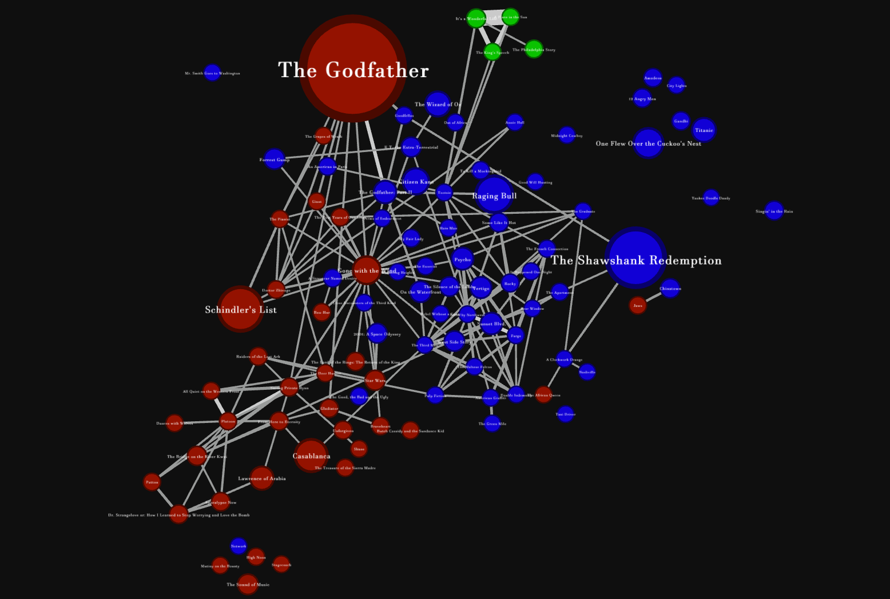

# Movie Plot Similarity Visualization

## General Info
* This project uses natural language processing and clustering to find similarity between the top 100 movies based on their IMDb and Wikipedia plot summaries

# Data Manipluiation

## Tokenization
* The first step is to tokenize the data, which is the process of breaking down large sequences of characters into indivdual tokens
* "Do you like Git?" would be split into the tokens: "do", "you", "like", "git", "?"

## Stemming
* The next step is to stem the tokens, or reduce them their root/base
* By doing this, words like "witness" and "witnesses" will both be reduced down to "wit" and recognized as equal
* This step is important because it allows us to establish meaning between different forms of the same word without dealing with each form and comparing

## Term Frequency-Inverse Document Frequency (TF-IDF) Vectorization
* In order to extract meaningful observations, we must transform the data into something the computer understands: numbers
* To do this we use Term Frequency to create vectors portraying the number of occurances of each word from the vocuabulary as a vector
* The Inverse Document Frequency parameter reduces the importance of words that appear often in several documents, such as "the". This
 allows words appear frequently in a small number of documents to be recognized as more significant
 
## K-Means Clustering
* Next we will group movies into similarity clusters by partitioning the vectors into k clusters in which each vector belongs to the cluster
 with the nearest mean
  
## Similarity Distance
* Finally we will calculate the cosine angle formed between each set of vectors to extract their similarity distance
* The similarity distance is found by subtracting the cosine angle from 1. A Smaller number means the plot summaries are more similar
* If two sentences were exactly the same, the cosin of their angle would be 1, so the distance between them would be 1 - 1 = 0

# Visualizations

## Dendrogram
 * A Dendrogram can be interpreted by focusing on the height at which two objects are joined. The smaller the height, the more similar the two objects or clusters are 
 to one another. 
 
 
 
## Gephi Weighted Graph
 * We found the dendrogram to be a little tough to interpret, so we imported our data into a visualization program called Gephi and created a weighted graph to better visualize the similarities. 
 ### Attributes
  * Node Size: determined by the top 100 rank of the movie, bigger means higher ranked
  * Node Color: determined by the cluster the movie belongs to
  * Edge Size: determined by the similarity of the movies to one another, larger means more similar and edges below a certain threshold were removed
  * Graph Position: A Gephi algorithm was used to determine the node positions on the graph, with minor adjustments for readability. The algorithm takes into account the node's cluster and edge weights between nodes. 
  

# Sources
This code is based on a guided project from [DataCamp](https://projects.datacamp.com/projects/648).
